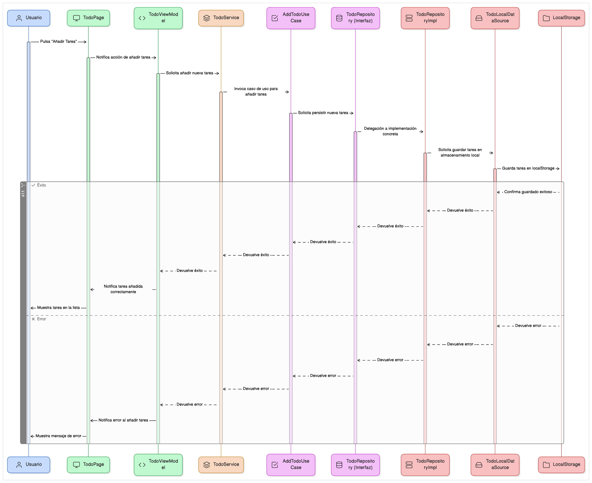

# 📋 ToDo App - Arquitectura Clean + MVVM

Esta aplicación es una lista de tareas construida con **Ionic + Cordova** siguiendo los principios de **Clean Architecture** y el patrón **MVVM (Model-View-ViewModel)**. El objetivo es lograr una separación clara de responsabilidades, facilitar el mantenimiento, testeo y escalabilidad del proyecto.

---

## 🧱 Arquitectura General

El proyecto se divide en **tres capas principales**:

### 1. 🧠 Capa de Dominio (Domain Layer)

Contiene la lógica de negocio pura de la aplicación.

- **Entidades**:  
  - `Todo`: Define la estructura principal de los datos (`id`, `title`, `description`, `isCompleted`).
- **Casos de Uso (Use Cases)**:  
  Implementan la lógica específica de negocio.
  - `AddTodoUseCase`
  - `GetAllTodosUseCase`
  - `UpdateTodoUseCase`
  - `DeleteTodoUseCase`
- **Repositorios (Interfaces)**:  
  Contratos abstractos que la capa de datos debe implementar.
  - `TodoRepository`

---

### 2. 💾 Capa de Datos (Data Layer)

Responsable del acceso a datos y persistencia.

- **Implementaciones de Repositorio**:
  - `TodoRepositoryImpl`: Implementa la interfaz `TodoRepository` definida en la capa de dominio.
- **Fuentes de Datos (Data Sources)**:
  - `TodoLocalDataSource`: Encargada de interactuar con `localStorage` u otras fuentes locales.
- **Modelos de Datos**:
  - `TodoModel`: Estructura que representa los datos según el origen y destino, y que puede mapearse a la entidad `Todo`.

---

### 3. 🎨 Capa de Presentación (Presentation Layer - MVVM)

Define la interfaz de usuario y su lógica asociada.

- **Vistas**:  
  - `TodoPage` (`todo.page.html`, `todo.page.scss`): La UI que interactúa con el usuario.
- **ViewModels**:  
  - `TodoViewModel`: Expone datos y acciones para la vista. Controla el estado de la UI.
  - `todo.viewmodel.mapper.ts`: Mapeo entre `Todo` y `TodoViewModel`.
- **Servicios de Presentación**:  
  - `TodoService`: Actúa como puente entre el ViewModel y los casos de uso.

---

## 🔁 Flujo de Interacción



1. **Usuario** interactúa con la vista (`TodoPage`).
2. La **vista** llama a un método en el **ViewModel** (`addTodo()`).
3. El **ViewModel** llama al método correspondiente del **servicio de presentación** (`TodoService`).
4. El **servicio** invoca el **caso de uso** (`AddTodoUseCase.execute()`).
5. El **caso de uso** utiliza la interfaz del **repositorio** (`TodoRepository`).
6. La implementación del repositorio llama a la **fuente de datos** (`TodoLocalDataSource`).
7. Se ejecuta la operación (guardar en `localStorage`).
8. El flujo de respuesta regresa a través de cada capa hasta llegar nuevamente a la **vista**, actualizando el estado.

---

## 🧭 Principios SOLID aplicados

La arquitectura implementa de manera explícita los principios **SOLID**, promoviendo calidad, mantenibilidad y escalabilidad:

### 1. ✅ Single Responsibility Principle (SRP)

Cada clase o módulo tiene una única razón para cambiar:

- `Todo`: solo define la estructura de datos.
- `AddTodoUseCase`, `GetAllTodosUseCase`, etc.: una tarea de negocio específica.
- `TodoRepository`: solo define contratos de persistencia.
- `TodoRepositoryImpl`: lógica de acceso a datos.
- `TodoPage`: solo se encarga de la vista.
- `TodoViewModel`: maneja el estado de la UI.
- `TodoService`: orquesta la comunicación entre presentación y dominio.

### 2. 🔒 Open/Closed Principle (OCP)

Las clases están abiertas a extensión, pero cerradas a modificación:

- Puedes agregar nuevos casos de uso sin modificar los existentes.
- Puedes implementar `TodoRepository` con diferentes fuentes (API, SQLite, Firebase) sin cambiar la interfaz.

### 3. 🔄 Liskov Substitution Principle (LSP)

Las implementaciones de `TodoRepository` pueden ser sustituidas sin romper el comportamiento esperado. Cualquier clase que implemente esta interfaz puede ser usada por los casos de uso sin necesidad de conocer su implementación concreta.

### 4. 🔍 Interface Segregation Principle (ISP)

Aunque actualmente la interfaz `TodoRepository` es unificada, en sistemas más complejos podría separarse:

- `TodoReaderRepository`: solo lectura.
- `TodoWriterRepository`: solo escritura.

Así, cada clase solo dependería de lo que realmente necesita.

### 5. 🧩 Dependency Inversion Principle (DIP)

- Los **casos de uso** dependen de **interfaces** (`TodoRepository`), no de implementaciones concretas.
- Las **implementaciones concretas** (`TodoRepositoryImpl`) son inyectadas en tiempo de ejecución.
- La **presentación** tampoco conoce las implementaciones, solo usa los casos de uso como abstracciones.

Esto permite el uso de inyección de dependencias y facilita los tests unitarios con mocks o stubs.

---

## 📁 Estructura del Proyecto (resumen)
src/
├── domain/
│ ├── entities/
│ ├── use-cases/
│ └── repositories/
├── data/
│ ├── models/
│ ├── repositories/
│ └── data-sources/
├── presentation/
│ ├── pages/
│ ├── viewmodels/
│ └── services/


---

## 📌 Requisitos

- Node.js 18.x
- Ionic CLI
- Cordova CLI (`npm install -g cordova`)

---

## ▶️ Ejecutar el proyecto

### En el navegador
```bash
npm install
ionic serve

